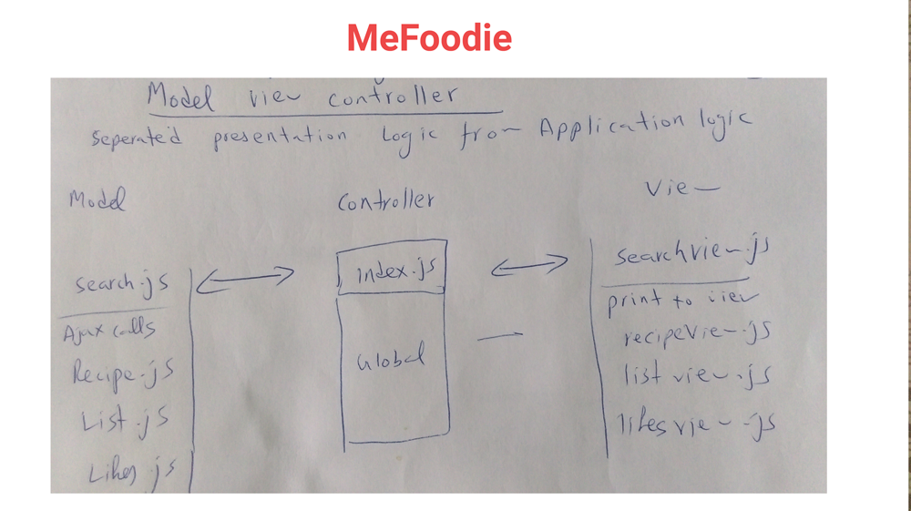
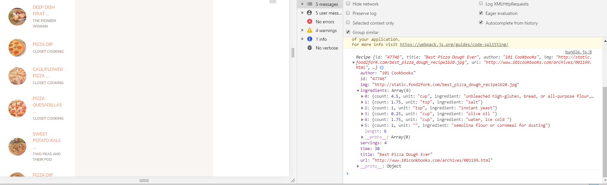
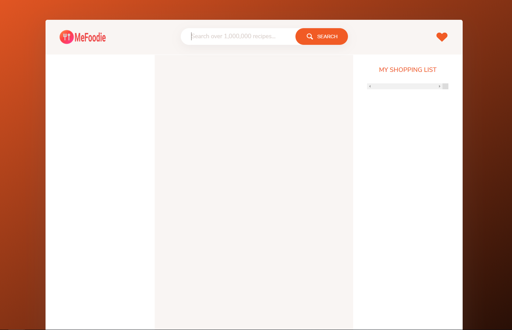
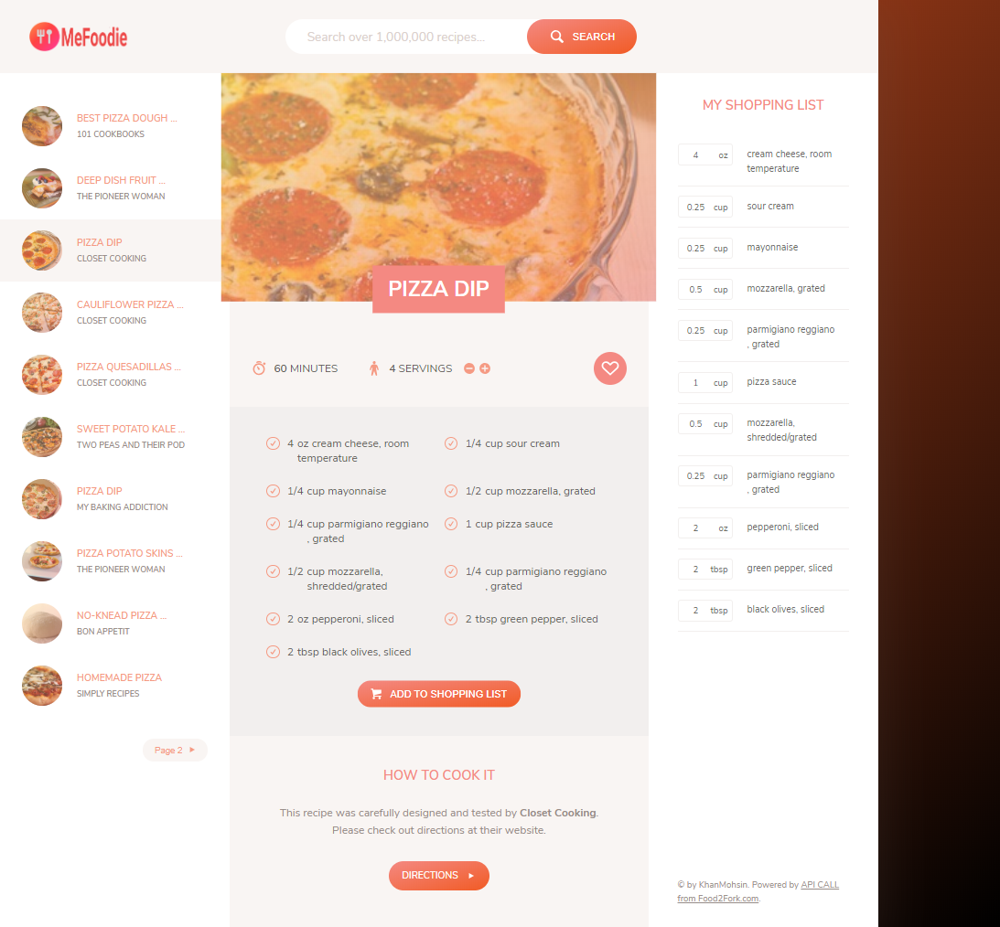

# MeFoodie
WebApp for searching recipes, changing the serving according to your requirements and to order nearby store.

Technologies Used: HTML5, CSS3, JavaScript ES6, WebPAck, NPM, Babel, Polyfill, Node.js, Tachyons, UniqIds etc
MVC architecture(Model View Controller)

Demo: https://m90khan.github.io/MeFoodie/dist/index.html  

How it works:
<ol>
  <li>I am using https://www.food2fork.com api to fetch the recipes data  (free version: so 50 calls a day)</li>
  <li>then I displayed LIST of recipes on the right side  </li>
  <li>I am targeting 30 recipes so I choose to display 10 recipes per page . added pagination.</li>
  <li>Limit the title characters and description  </li>
  <li>Once the recipe is displayed on the right side, the user clicks on the desired recipe to view and it gets displayed in the middle section.</li>
  <li> Now we have recipe in the middle with full view. implemented the DOM manipulation which allows users to change the servings of the recipes and ingredients. </li>
  <li>User can like and dislike the recipe and updated results will be shown even the user refreshed the page. </li>
  <li>on user action to cart, user can add ingredients of recipes to the shopping list.  </li>
  <li>From the shopping list, the user can order the ingredients from stores like netto, amazon fresh etc (could be future additions)
 </li>

